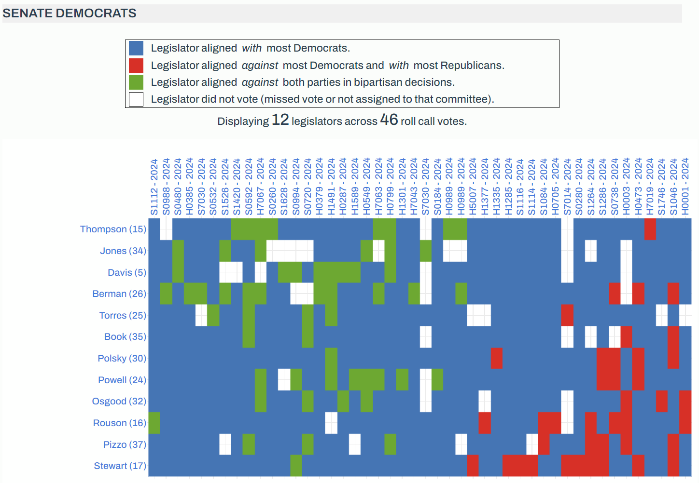
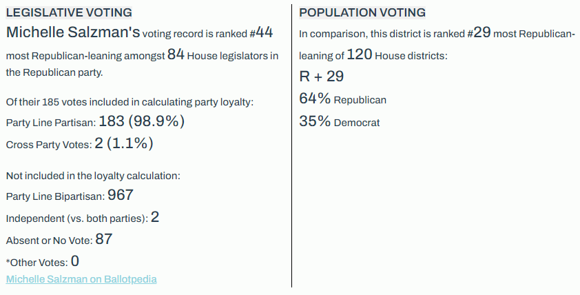

# Legislator Dashboard
7/30/24

This repo tracks development of the Jacksonville Tributary's interactive legislative dashboard, which is based on roll call vote data from [Legiscan](https://legiscan.com/FL/datasets) as well as elections and demographic data from [Dave's Redistricting](https://davesredistricting.org/maps#state::FL). Data is prepared for display in an [ETL data pipeline](https://github.com/reliablerascal/fl-legislation-etl).

Here's the **[development version](https://mockingbird.shinyapps.io/fl-leg-app-postgres/)** of the web app, as described in this repo.

The app consists of the following visualizations:
|Tab|Intended Audience|Description
|---|---|---|
|**Legislator Lookup**|voting public|Find your state and national representatives based on your home address.|
|**District Context**|voting public|Compare each representative's partisan voting patterns against their demographic and electoral context.|
|**Voting Patterns**|data-savvy journalists at Florida partner outlets|Display a heatmap of voting patterns on contested bills by party, chamber, and session year|


## Applications

<div align = "left">

### Voting Patterns Dashboard

<div style = "padding-left: 20px;">


*Figure 1: Dashboard view of **Voting Patterns** web app of Senate Democrats during 2024 legislative session*
</div>

<br><br>

### District Context Web App
This is a new app, incorporating some partisanship data from the Voting Patterns dashboard in addition to newly integrated census and electoral data.
<div style = "padding-left: 20px;">


*Figure 2: **District Context** web app comparing a legislator's voting record with their electorate's partisan leaning*
</div>

<br><br>

## Ongoing Development
See the following documents for info on past and current development:
* [changelog](docs/changelog.md)- updates in the alpha and beta versions
* [Voting Patterns development notes](https://docs.google.com/document/d/1OGiJH7B_0j3B38gEtgt_FDhkxzL84ZtGistdup2yYHI/edit?usp=drive_link)
* [District Context development notes](https://docs.google.com/document/d/1e3KDrnpXjKL4OJqFR49hqti77TntPRL7k4AkqSfsefU/edit?usp=drive_link)

<br><br>

## Guide to This Repository
Typical of Shiny apps, this repo consists of the following R components:
- [app.R](app.R): Orchestrates the Shiny app by setting up the user interface, server logic, and handling reactive expressions for the Shiny web app.
- Server scripts: Application logic for each application.
    - [server1_vote_patterns.R](servers/server1_vote_patterns.R)
    - [server3_district_context.R](servers/server3_district_context.R)
    - [server5_legislator_lookup.R](servers/server5_legislator_lookup.R)
- [ui.R](ui.R): Defines the Shiny app user interface.


```
├── app.R
├── data
│   └── all_data.rds
├── docs
│   └── changelog.md
├── read_data.R
├── save_data.R
├── servers
│   ├── server1_partisanship.R
│   └── server3_district_context.R
│   └── server5_legislator_lookup.R
├── ui.R
└── www
│   └── styles.css
```
```
fl-legislation-app-postgres
├─ .git
│  ├─ COMMIT_EDITMSG
│  ├─ config
│  ├─ description
│  ├─ FETCH_HEAD
│  ├─ HEAD
│  ├─ hooks
│  │  ├─ applypatch-msg.sample
│  │  ├─ commit-msg.sample
│  │  ├─ fsmonitor-watchman.sample
│  │  ├─ post-update.sample
│  │  ├─ pre-applypatch.sample
│  │  ├─ pre-commit.sample
│  │  ├─ pre-merge-commit.sample
│  │  ├─ pre-push.sample
│  │  ├─ pre-rebase.sample
│  │  ├─ pre-receive.sample
│  │  ├─ prepare-commit-msg.sample
│  │  ├─ push-to-checkout.sample
│  │  └─ update.sample
│  ├─ index
│  ├─ info
│  │  └─ exclude
│  ├─ logs
│  │  ├─ HEAD
│  │  └─ refs
│  │     ├─ heads
│  │     │  └─ master
│  │     └─ remotes
│  │        └─ origin
│  │           └─ HEAD
│  ├─ objects
│  │  ├─ 01
│  │  │  └─ 75d01aefa0513bc7b5f0bf720be3e17e045b13
│  │  ├─ 10
│  │  │  └─ f69b66ea26f99417c0d9f4977b1637e5e788f1
│  │  ├─ 3d
│  │  │  └─ 1df9aaf821e26491bb804f1107bde35e079a38
│  │  ├─ 51
│  │  │  └─ 21261229b653e83a1bbdb0f48275a25e53c256
│  │  ├─ 57
│  │  │  └─ 8e9dd0a483f26af6f580fb5e409ff02731bb5a
│  │  ├─ 62
│  │  │  └─ e103b0e42fe60ef602c176cd624489d94ea1f3
│  │  ├─ 67
│  │  │  └─ 37aa0e2441d09b15cb4a485aaa5241c475009c
│  │  ├─ 7d
│  │  │  └─ 2e6432a11ae55a54174a7e5d811aef07e172cb
│  │  ├─ 7e
│  │  │  └─ 5c6d4734bc4f86db318e0d025b0900afd5eb70
│  │  ├─ 83
│  │  │  └─ c9066d9dae12f5b177d3462bf605630df9da71
│  │  ├─ 8b
│  │  │  └─ 3294e7bec1d8226f803d35c3ab671e187a8379
│  │  ├─ 90
│  │  │  └─ 2ecbc6aac18aa77a872cd0f7ed845c9b852980
│  │  ├─ a8
│  │  │  └─ 98a583657cd30f937896b53fc22dd44953c05e
│  │  ├─ b5
│  │  │  └─ 97c42ddaa53e2d9fadd60cc2bde42d5e98fa58
│  │  ├─ cf
│  │  │  └─ 5b8b1abcd57cbe403e7cf61ba91a0af0780553
│  │  ├─ f9
│  │  │  └─ ff5cd7070e53ec6df4b449db8c2e700aeedd60
│  │  ├─ info
│  │  └─ pack
│  │     ├─ pack-94cf0b276a0f528a9f2a91601c75c1a6b65610d5.idx
│  │     └─ pack-94cf0b276a0f528a9f2a91601c75c1a6b65610d5.pack
│  ├─ ORIG_HEAD
│  ├─ packed-refs
│  └─ refs
│     ├─ heads
│     │  └─ master
│     ├─ remotes
│     │  └─ origin
│     │     └─ HEAD
│     └─ tags
├─ .gitattributes
├─ .github
│  └─ workflows
│     └─ azure-deploy.yml
├─ .gitignore
├─ .Rbuildignore
├─ app.R
├─ Dockerfile
├─ fl-legislation-app-postgres.Rproj
├─ README.md
├─ read_data.R
├─ rsconnect
│  └─ shinyapps.io
│     └─ mockingbird
│        └─ fl-leg-app-postgres.dcf
├─ save_data.R
├─ servers
│  ├─ app4-initial.R
│  ├─ app4.R
│  ├─ server1_vote_patterns.R
│  ├─ server2_leg_activity.R
│  ├─ server3_district_context.R
│  └─ server4_partisanship_scatterplot.R
├─ ui.R
└─ www
   └─ styles.css

```